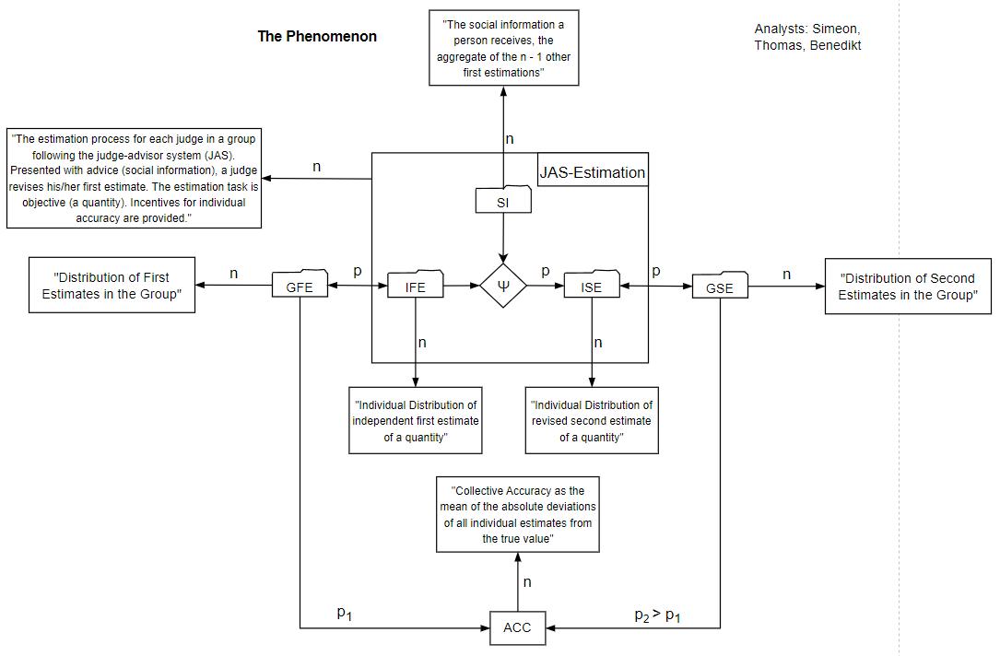
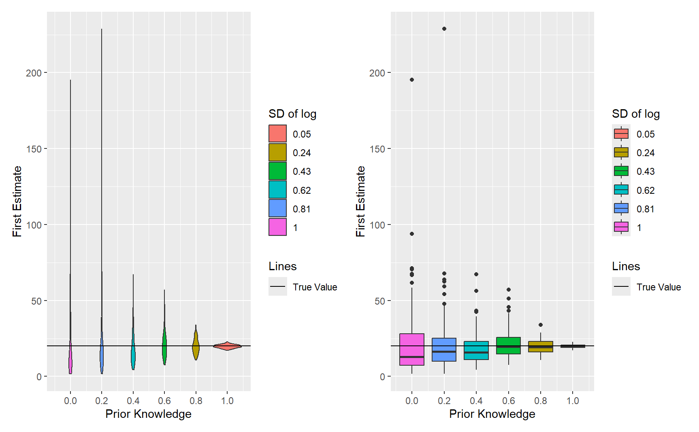

```{r setup, include = FALSE}
library("papaja")
r_refs("r-references.bib")
```

```{r analysis-preferences}
# Seed for random number generation
set.seed(42)
knitr::opts_chunk$set(cache.extra = knitr::rand_seed)
```

# Zielsetzung

Die Forschung zum decision-making von Gruppen und ihren einzelnen Mitgliedern ist zu gemischten Befunden über die Auswirkungen von sozialem Einfluss auf die einzelnen Entscheidungen und die der Gruppe gelangt. Die vorliegende Arbeit versucht, einzelne Befunde aus der Literatur in ein Modell der Entscheidungsfindung auf individueller und auf Gruppenebene zu integrieren. So kann geprüft werden, ob die jetzige Forschung (natürlich nur grob umrissen) ein kohärentes Bild ergibt und welche Zusammenhänge weiter beforscht werden sollten, und zu welchen Aussagen dieses Modell über die Schätzgenauigkeit der einzelnen Mitglieder und der Gruppe kommen würde.

# Einleitung

Die Forschung zum *decision-making* von Individuen und Gruppen untersucht u.a. die Umstände, unter denen Gruppen genaue Schätzungen abgeben, und wann einzelne Gruppenmitglieder akkurater schätzen als die Gruppe. Die robusten Befunde zum Wisdom-of-Crowds-Effekt (WOC) legen nahe, dass Gruppenschätzungen dann sehr oft akkurater sind als die Schätzungen der meisten Individuen bzw. des durchschnittlichen Individuums in der Gruppe, wenn Personen ihre Schätzungen unabhängig voneinander abgeben und dann über diese aggregiert wird [e.g., @jayles_how_2017]. Die Unabhängigkeit soll die Diversität der Einzelurteile bewahren, die durch eine möglichst gleichmäßige Streuung der Werte um den wahren Wert herum (*bracketing*) einen schädlichen Gruppenbias ausgleichen können [@krueger_social_2012].

Nicht zuletzt wegen der Alltagsferne der Unabhängigkeitsannahme wird untersucht, welche Auswirkungen sozialer Einfluss auf die individuellen Schätzungen und die resultierenden Gruppenschätzungen hat. Sozialer Einfluss wird meistens mit dem JAS-Paradigma [zitiert nach @bailey_meta-analysis_2023] untersucht, bei dem Personen zuerst eine unabhängige Schätzung einer objektiven Größe abgeben, dann Informationen über die Schätzungen der anderen Gruppenmitgliedern erhalten (soziale Information), und ihre Schätzung noch einmal revidieren können, um zu einer zweiten Schätzung zu gelangen. Anreize für möglichst genaue Schätzungen werden gegeben und der Informationsaustausch anonymisiert, um den *informational influence* zu fördern und den *normative influence* gering zu halten [@rader_advice_2017].

# Das Phänomen

In dieser Arbeit beschränken wir uns auf Studien, die mit dem JAS-Paradigma vereinbar sind und die Auswirkungen von sozialem Einfluss im Hinblick auf die Schätzgenauigkeit von Gruppen untersuchen. Dabei werden zwei Messungen für die Schätzgenauigkeit der Gruppe unterschieden: Maße für die Schätzgenauigkeit der Individuen in der Gruppe und Maße für die Genauigkeit der Gruppenschätzung. Nach @jayles_how_2017 nennen wir die beiden Maße *collective accuracy* und *collective performance*. Untersuchen Studien den sozialen Einfluss auf die WOC, sind sie v.a. daran interessiert, wie sich die collective performance nach Gabe sozialer Information verändert. Da viele Studien den Fokus aber mehr auf die collective accuracy legen [e.g., @gurcay_power_2015, @yaniv_receiving_2004] und Studien mit Fokus auf die performance diese ins Verhältnis zur accuracy setzen [e.g., @becker_network_2017, @frey_social_2021], beschränken wir uns auf den sozialen Einfluss auf die collective accuray als kleinsten gemeinsamen Nenner der Literatur.

Außerdem wirken die Befunde zum Einfluss sozialer Information auf die accuracy konsistenter als zur performance. @lorenz_how_2011 stellte einen Performance-Verlust nach sozialem Einfluss fest, gleichzeitig kann sich bei einer solcher Verschlechterung der Gruppenschätzung aber die Genauigkeit der einzelnen Schätzungen erhöhen [@frey_social_2021]. @becker_network_2017 stellten sowohl eine Verbesserung der performance als auch der accuracy fest und @yaniv_receiving_2004 eine Verbesserung der accuracy. Nach dieser Literatursuche kommen wir zu folgender Formulierung des Phänomens (**Fig. 1**): *Wenn der Schätzprozess von Individuen wo abläuft, wie es das JAS-Paradigma zeichnet, ist die mittlere Abweichung der einzelnen Schätzungen der Gruppenmitglieder vom wahren Wert (collective accuracy) nach Gabe von sozialer Information geringer als ohne soziale Information*. Als zusammenfassendes Maß für die collective accuracy verwenden wir also das arithmetische Mittel der einzelnen Abweichungen. Nach einer Einordnung einzelner Studien in die UTOS-Dimeonsionen kommen wir zu dem Schluss, dass das Phänomen nicht generalisierbar ist und die Stärke der Evidenz schwach ist (**Box. 1**).

(ref:my-figure-caption) Das Phänomen.

```{r my-figure, fig.cap = "(ref:my-figure-caption)"}

```

Da sich die Zielvariable collective accuracy auf Gruppenebene befindet, aber ein emergentes Phänomen der Schätzprozesse einzelner Gruppenmitglieder ist, ist der individuelle Schätzprozess eines Individuums in die Gruppenschätzung eingebettet und wirkt auf deren Ergebnisse. Der Übergang zwischen individueller und Gruppenschätzung wird über die Beziehung von GFE zu IFE und von GSE zu ISE hergestellt; GFE und ISE sind lediglich die Sammlungen der einzelnen Schätzungen. Als solche werden sie durch die eingehenden individuellen Schätzungen bestimmt, ungeachtet der Reihenfolge kann eine einzelne Schätzung umgekehrt als Realisation der Verteilung der Schätzungen in der Gruppe verstanden werden (bidirektionale p-relationships). Aus den Sammlungen GFE und ISE wird dann die collective accuracy berechnet.

# Das Modell

Die Modellierung der Gruppenschätzung beruht auf der Modellierung der ihr zugrundeliegenden individuellen Schätzprozesse der *n* Gruppenmitglieder (**Fig. 2**). Im Mittelpunkt der Beschreibung dieser Schätzprozesse steht die Annahme aus der Literatur, dass Personen den gewichteten Mittelwert aus ihrer ersten Schätzung (IFE) und der sozialen Information (SI) nehmen, um zu ihrer zweiten Schätzung (ISE) zu gelangen. Das Gewicht, das der SI beigemessen wird (*Weight on Advice, WOA*), wird dabei gegen das Gewicht aufgewogen, das Personen der IFE beimessen (*Self-Weight, 1 – WOA*). Wir gehen allerdings davon aus, dass diese Verrechnung die zweite Schätzung nicht deterministisch bestimmt, sondern lediglich den Mittelwert einer schmalen Normalverteilung festgelegt, die nicht weiter spezifizierten Einflüssen Rechnung trägt. Das Ergebnis der Formel kann psychologisch als der Wert interpretiert werden, zu dem eine Person im Mittel hintendiert (zentrale Tendenz der ISE-Verteilung).

(ref:my-modell) Das Modell.

```{r my-figure2, fig.cap = "(ref:my-modell)"}
knitr::include_graphics("Abbildungen/VAST_Modell.png")
```

Psychologisch können die WOA und das Self-Weight einer Person als ihre Sensitivität bzw. Resistenz gegenüber sozialer Information interpretiert werden [vgl. @jayles_how_2017, @madirolas_improving_2015]. Als mathematische Größen bestimmen sie, wie weit Personen bei ihrer ersten Schätzung bleiben oder sich der sozialen Information anpassen (Revisionsstärke). Deshalb können sie als indirekte Maße dafür gelten, wie weit die erste Schätzung einer Person in die Gruppenschätzung miteingeht und diese mitbestimmt. @becker_network_2017 nennen diesen Einfluss social influence weight, und ihre Argumentation für die collective performance lässt sich auch auf die collective accuracy übertragen, solange diese als Mittelwert der zweiten Schätzungen berechnet wird, in die ja die ersten Schätzungen je nach Self-Weights unterschiedlich stark eingehen.

Eine weitere Interpretation des Self-Weights wird von @madirolas_improving_2015 geliefert: Die Autoren spekulieren, ob das Self-Weight möglicherweise eine behaviorale Messung der Confidence einer Person ist (CONF2). Tatsächlich berichten @rader_advice_2017 und @bailey_meta-analysis_2023 von einer negativen Korrelation zwischen Confidence und dem WOA (CONF1 & CONF2). Wir interpretieren die Confidence primär als sachbezogenes Vertrauen in die erste Schätzung und vernachlässigen anderweitige Einflüsse (bspw. durch das generelle Selbstvertrauen einer Person). Wir gehen dementsprechend davon aus, dass sich das Vertrauen von Personen in ihre ersten Schätzungen direkt aus ihrem Vorwissen ergibt. Durch diese Mediation korreliert das Vorwissen positiv mit dem Self-Weight und negativ mit dem WOA. Es ist davon auszugehen, dass das Vorwissen unterschiedlich in der Gruppe verteilt ist (PK1). In unserer Simulation wird das Vorwissen einer Person (IPK) aus dieser Verteilung (GPK) gezogen.

@madirolas_improving_2015 und @jayles_how_2017 nehmen den Logarithmus der (unabhängigen) Schätzungen von Personen, um von ihrer ursprünglich nach rechts verzerrten Verteilung zu symmetrischeren Normal- oder Cauchy-Verteilungen zu gelangen. Während die Mehrheit der Werte eher niedrig sind, streuen einige Werte weit nach oben, und diese Verteilung kann als logarithmische Normalverteilung dargestellt werden. Wir nehmen deshalb für jede einzelne Person eine solche Lognormal-Verteilung ihrer ersten Schätzungen an (IFE). Wir gehen davon aus, dass die IFE-Verteilungen nicht für alle Personen gleich aussehen, sondern sich je nach ihrem Vorwissen unterscheiden. Höheres Vorwissen sollte die individuelle Schätzgenauigkeit erhöhen, sodass sich die IFE-Verteilung um den wahren Wert zuspitzt (**Fig. 3**). Für den Zusammenhang zwischen Vorwissen und Schätzgenauigkeit spricht @jayles_how_2017´s Erklärung für die gefundenen, breit-geflügelten Cauchy-Verteilungen: Die hohe Aufgabenschwierigkeit sorgt dafür, dass Personen beim Schätzen wegen geringen Vorwissens öfter weit entfernt vom wahren Wert liegen.

(ref:my-plot) IFE Verteilungen für unterschiedliche Vorwissenswerte.

```{r my-figure3, fig.cap = "(ref:my-plot)"}

```

Ein weiterer Einflussfaktor auf das WOA ist die Abweichung der ersten Schätzung einer Person von der sozialen Information, die sie erhält (logarithmisch transformiert). In Studien wurde ein negativer Zusammenhang zwischen dieser Abweichung und dem der WOA festgestellt (D1 & D2 & D3). Da die Revisionstärke mit zunehmender Schätzgenauigkeit von Personen aber auch dann noch steigt, wenn die Distanz konstant gehalten wird [@becker_network_2017], nehmen wir an, dass die Abweichung die WOA nicht erschöpfend vorhersagt, sondern lediglich zusätzlich zur Confidence wirkt, indem sie diese modifiziert. @rader_advice_2017 berichten, dass eine geringe Abweichung die Confidence von Personen erhöht (D5). Analog gehen wir davon aus, dass eine hohe Abweichung die Confidence verringert. Wir gehen aber nicht von einem linearen Zusammenhang aus, sondern dass die bestätigende Wirkung geringer Abweichungen bei unsicheren Personen stärker ist und die verunsichernde Wirkung großer Abweichungen bei Personen mit hoher Confidence stärker ist (**Fig. 4**). So kann erklärt werden, dass Personen sich naher sozialer Information oft nicht anpassen. Außerdem zitieren @rader_advice_2017 einen Einzelbefund davon, dass Experten sich von ferner sozialer Information nicht beirren ließen.


\newpage

# Referenzen

::: {#refs custom-style="Bibliography"}
:::
