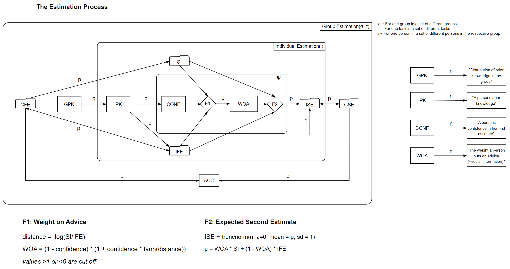

```{r setup, include = FALSE}
library("papaja")
r_refs("r-references.bib")
```

```{r analysis-preferences}
# Seed for random number generation
set.seed(42)
knitr::opts_chunk$set(cache.extra = knitr::rand_seed)
```


# Zielsetzung

Die vorliegende Arbeit versucht, einzelne Befunde zur Verarbeitung sozialer Information bei Schätzaufgaben in ein Modell der Schätzprozesse auf individueller und Gruppenebene zu integrieren. Es wird geprüft, ob diese Dekomposition empirische Befunde zu Auswirkungen sozialen Einflusses auf die Schätzgenauigkeit reproduzieren kann.

# Einleitung

Die Forschung zum decision-making von Individuen und Gruppen untersucht u.a. die Umstände, unter denen Gruppen genaue Schätzungen abgeben, und wann einzelne Gruppenmitglieder akkurater schätzen als die Gruppe. Die robusten Befunde zum Wisdom-of-Crowds-Effekt (WOC) legen nahe, dass Gruppenschätzungen dann sehr oft akkurater sind als die Schätzungen der meisten Individuen bzw. des durchschnittlichen Individuums in der Gruppe, wenn Personen ihre Schätzungen unabhängig voneinander abgeben und dann über diese aggregiert wird (e.g., Surowiecki J., 2004).

Nicht zuletzt wegen der Alltagsferne der Unabhängigkeitsannahme wird untersucht, welche Auswirkungen sozialer Einfluss auf die individuellen Schätzungen und die resultierenden Gruppenschätzungen hat. Sozialer Einfluss wird meistens mit dem JAS-Paradigma [zitiert nach @bailey_meta-analysis_2023] untersucht, in dem Personen zuerst eine unabhängige Schätzung einer objektiven Größe abgeben, dann Informationen über die Schätzungen der anderen Gruppenmitgliedern erhalten (soziale Information), ihre Schätzung anschließend noch einmal revidieren und so schließlich zu einer zweiten Schätzung kommen. Es werden Anreize für möglichst genaue Schätzungen gegeben und der Informationsaustausch erfolgt anonymisiert, sodass der *informational influence* den *normative influence* möglichst überwiegt [@rader_advice_2017].

# Das Phänomen

In dieser Arbeit beschränken wir uns auf Studien, die mit dem JAS-Paradigma vereinbar sind und die Auswirkungen von sozialem Einfluss im Hinblick auf die Schätzgenauigkeit von Gruppen untersuchen. Dabei werden zwei Messungen für die Schätzgenauigkeit der Gruppe unterschieden: Maße für die Schätzgenauigkeit der Individuen in der Gruppe und Maße für die Genauigkeit der Gruppenschätzung. Nach @jayles_how_2017 nennen wir die beiden Maße *collective accuracy* und *collective performance*. Untersuchen Studien den sozialen Einfluss auf die WOC, sind sie v.a. daran interessiert, wie sich die collective performance nach Gabe sozialer Information verändert. Da viele Studien den Fokus aber mehr auf die collective accuracy legen [e.g., @gurcay_power_2015, @yaniv_receiving_2004] und viele Studien mit Fokus auf die performance diese ins Verhältnis zur accuracy setzen [e.g., @becker_network_2017, @frey_social_2021], beschränken wir uns auf den sozialen Einfluss auf die collective accuray als den kleinsten gemeinsamen Nenner der Literatur.

Außerdem wirken die Befunde zum Einfluss sozialer Information auf die accuracy konsistenter als zur performance. Bei der Formulierung des Phänomens beziehen wir uns auf das folgende Datenmuster: *Wenn der Schätzprozess von Individuen so abläuft, wie es das JAS-Paradigma vorgibt, ist die mittlere Abweichung der einzelnen Schätzungen der Gruppenmitglieder vom wahren Wert (collective accuracy) nach Gabe von sozialer Information geringer als ohne soziale Information* (**Fig. 1**). Als zusammenfassendes Maß für die collective accuracy verwenden wir also das arithmetische Mittel der einzelnen Abweichungen.


(ref:phenomenon) Das Phänomen in VAST [@leising_visual_2023].

```{r my-figure1, fig.cap = "(ref:phenomenon)"}
knitr::include_graphics("Abbildungen/VAST_Phänomen.png")
```


## UTOS-Dimensionen

*Units*. Das Phänomen wurde über insgesamt 800 Versuchspersonen untersucht [@gurcay_power_2015; @becker_network_2017], wobei ca. ein Drittel der Teilnehmer Studenten aus derselben Universität waren.

*Treatments*. @yaniv_receiving_2004 beobachteten positive Effekt auf die collective accuracy bei Gruppen unterschiedlichen Vorwissens, auch wenn diese bei höherem Vorwissen schwächer sind.  @gurcay_power_2015 erweiterten die bereitgestellten Informationen, indem Teilnehmern die volle Verteilung der Schätzungen der anderen sowie potenzielle Hinweisreize auf ihre Qualität (Confidence-Ratings) gegeben wurden. Außerdem fanden sie die positiven Effekte sozialen Einflusses unabhängig davon, ob Anreize zur Verbesserung der eigenen Schätzgenauigkeit oder der der Gruppe gegeben wurde. Des Weiteren fanden sie die Effekte nicht nur innerhalb von Personen (*within-subject*)., sondern auch zwischen Gruppen (*between-subject*).

*Outcomes*. Es werden mindestens drei unterschiedliche Maße für die collective accuracy herangezogen: Der Mittelwert [@yaniv_receiving_2004; @becker_network_2017] oder der Median [@jayles_how_2017] der absoluten individuellen Fehler, die prozentualen Abweichungen vom wahren Wert [@gurcay_power_2015] sowie eine logarithmische Transformation der Abweichungen [@lorenz_how_2011].

*Settings*. Studien wurden sowohl online [@yaniv_receiving_2004; @becker_network_2017] als auch im Labor durchgeführt [@jayles_how_2017]. Die Übertragbarkeit ins Feld ist allerdings nicht gegeben, da auch in Laborstudien anonymisierte Bedingungen und mangelnde Interaktionen vorausgesetzt werden. Zumindest bei @gurcay_power_2015 gab es eine sehr indirekte Form der Interaktion über Confidence-Ratings.

Insgesamt kommen wir zu dem Schluss, dass das Phänomen als wenig robust gelten muss. Besonders auf der Seite der sozialen Information wurden zu wenige Variationen getestet, obwohl diese sicherlich große Auswirkungen haben. Dementsprechend werden viele Prozesse im Vornherein ausgeschlossen, die in natürlichen Interaktionen eine große Rolle spielen und die Übertragbarkeit ins Feld deshalb stark einschränken.

## Evidenzstärke

Unsere Literaturrecherche ergab nur drei Studien, die genau dieses Phänomen untersuchten [@yaniv_receiving_2004; @becker_network_2017; [@gurcay_power_2015]. Die Ergebnisse von @jayles_how_2017 beziehen sich eher indirekt auf das Phänomen, da die Autoren es erst nach experimenteller Manipulation beobachteten. Alle drei Studien wirken methodologisch robust, weil sie ausreichende Stichprobengrößen umfassen und sehr klaren Protokollen folgten. Nicht zuletzt wegen der Sparsamkeit des JAS-Paradigmas konnten alle drei Studien Operationalisierungen wählen, in denen Störvariablen wenig in Erscheinung treten. Außerdem berichten alle drei Paper klare Richtungen und Messungen für den Effekt. Insgesamt schätzen wir die Evidenzstärke wegen der geringen Artikelanzahl und der geringen Generalisierbarkeit aber als schwach ein.

# Die Theorie

@becker_network_2017 konnten theoriegeleitete Voraussagen über die Ursachen des positiven Effekts sozialen Einflusses empirisch validieren. Ihre Annahme ist, dass sich Gruppenschätzungen verbessern, wenn akkurate Gruppenmitglieder auf ihrer ersten Schätzung verharren und sich gleichzeitig ungenaue Schätzer eher an die soziale Information anpassen. Diesen Zusammenhang zwischen individueller Schätzgenauigkeit und Gewichtung der eigenen Meinung nennen sie *Revisionskoeffizient*. Sie fanden heraus, dass sich u.a. die collective accuracy verbesserte, je höher der Revisionskoeffizient war.

Die Voraussetzungen für die Effektivität des Revisionskoeffizienten sind allerdings, dass Personen ihre Schätzgenauigkeit und die der Gruppe richtig einschätzen und sich nicht übermäßig verunsichern lassen, und dass die sozialen Informationen tatsächlich akkurater sind als die Personen, die sich an sie anpassen. @frey_social_2021 halten letzteres gerade wegen des WOC-Effekts für realistisch.

# Das Basismodell


(ref:basismodell) Das Basismodell in VAST [@leising_visual_2023].

```{r my-figure2, fig.cap = "(ref:basismodell)"}

```


Die Modellierung der Gruppenschätzung beruht auf der Modellierung der ihr zugrundeliegenden individuellen Schätzprozesse der n Gruppenmitglieder (**Fig. 2**). Im Mittelpunkt der Beschreibung dieser Schätzprozesse steht die Annahme aus der Literatur, dass Personen den gewichteten Mittelwert aus ihrer ersten Schätzung (IFE) und der sozialen Information (SI) nehmen, um zu ihrer zweiten Schätzung (ISE) zu gelangen. Das Gewicht, das der SI beigemessen wird (Weight on Advice, WOA), wird dabei gegen das Gewicht aufgewogen, das Personen der IFE beimessen (Self-Weight, 1 – WOA). Wir gehen allerdings davon aus, dass diese Verrechnung die zweite Schätzung nicht deterministisch bestimmt, sondern lediglich den Mittelwert einer schmalen Normalverteilung festgelegt, die nicht weiter spezifizierten Einflüssen Rechnung trägt. Das Ergebnis der Formel kann psychologisch als der Wert interpretiert werden, zu dem eine Person im Mittel tendiert.

@madirolas_improving_2015 spekulieren, ob das Self-Weight möglicherweise eine behaviorale Messung der *Confidence* einer Person ist (CONF2). Tatsächlich berichten @rader_advice_2017 und @bailey_meta-analysis_2023 von einer negativen Korrelation zwischen Confidence und dem WOA (CONF1 & CONF2). Wir interpretieren die Confidence primär als sachbezogenes Vertrauen in die erste Schätzung und vernachlässigen anderweitige Einflüsse (bspw. durch das generelle Selbstvertrauen einer Person). Wir gehen dementsprechend davon aus, dass sich das Vertrauen von Personen in ihre ersten Schätzungen direkt aus ihrem Vorwissen ergibt. Durch diese Mediation korreliert das Vorwissen positiv mit dem Self-Weight und negativ mit dem WOA. Es ist davon auszugehen, dass das Vorwissen unterschiedlich in der Gruppe verteilt ist (PK1). In unserer Simulation wird das Vorwissen einer Person (IPK) aus dieser Verteilung (GPK) gezogen.

@madirolas_improving_2015 und @jayles_how_2017 nehmen den Logarithmus der (unabhängigen) Schätzungen von Personen, um von ihrer ursprünglich nach rechts verzerrten Verteilung zu symmetrischeren Normal- oder Cauchy-Verteilungen zu gelangen. Gemäß @lorenz_how_2011 nehmen wir deshalb für jede einzelne Person eine Lognormal-Verteilung ihrer IFE an. Wir gehen davon aus, dass die IFE-Verteilungen nicht für alle Personen gleich aussehen, sondern sich je nach ihrem Vorwissen unterscheiden. Höheres Vorwissen sollte die individuelle Schätzgenauigkeit erhöhen, sodass sich die IFE-Verteilung um den wahren Wert zuspitzt (**Fig. 3**). Für den Zusammenhang zwischen Vorwissen und Schätzgenauigkeit spricht @jayles_how_2017 ´s Erklärung für die gefundenen, breit-geflügelten Cauchy-Verteilungen: Die hohe Aufgabenschwierigkeit sorgt dafür, dass Personen wegen geringen Vorwissens beim Schätzen häufiger weit entfernt vom wahren Wert liegen.


(ref:pkfe) IFE-Verteilungen für verschiedes Vorwissen. Violinen-Plot (*links*) und Box-Plot (*rechts*).

```{r my-figure3, fig.cap = "(ref:pkfe)"}

```


Aus den beiden vorherigen Abschnitten wird ersichtlich, dass wir die Befunde zum Revisionskoeffizienten [e.g., jayles_how_2017; becker_network_2017] in das Modell mitaufgenommen haben, indem die Breite der IFE-Verteilungen und die Confidence von Personen durch ihr Vorwissen *konfundiert* werden.

Ein weiterer Einflussfaktor auf das WOA ist die Abweichung der ersten Schätzung einer Person von der sozialen Information, die sie erhält (logarithmisch transformiert). In Studien wurde ein negativer Zusammenhang zwischen dieser Abweichung und dem WOA festgestellt (D1 & D2 & D3). Da die Revisionsstärke mit zunehmender Schätzgenauigkeit von Personen aber auch dann noch steigt, wenn die Distanz konstant gehalten wird [@becker_network_2017], nehmen wir an, dass die Abweichung die WOA nicht erschöpfend vorhersagt, sondern lediglich zusätzlich zur Confidence wirkt, indem sie diese modifiziert. @rader_advice_2017 berichten, dass eine geringe Abweichung die Confidence von Personen erhöht (D5). Analog gehen wir davon aus, dass eine hohe Abweichung die Confidence verringert. Wir gehen aber nicht von einem gleichförmig linearen Zusammenhang aus, sondern dass die verunsichernde Wirkung großer Abweichungen bei Personen mit hoher Confidence stärker ausfällt (**Fig. 4**). Bei ihnen führen nur hohe Abweichungen zu langsamen Anstiegen im WOA.


(ref:devconfwoa1) Veränderung verschiedener Confidence-Werte je nach Deviation und Auswirkungen auf das WOA.

```{r my-figure4, fig.cap = "(ref:devconfwoa1)"}

```


# Die Extension

@rader_advice_2017 berichten, dass Personen häufig SI ignorieren, die weit von ihrer ersten Schätzung abweichen (D6). Dieses Verhalten wollen wir in das Basismodell mitaufnehmen und ziehen eine andere Textstelle als Erklärung heran. Die Autoren beschreiben die Personenvariable Reaktanz als mögliche Ursache dafür, dass Personen abweichende SI weniger wahrscheinlich annehmen (WOA8). Ist die Abweichung groß, werden bei bestimmten Personen negative Wahrnehmungen der SI ausgelöst, die das WOA verringern. Auf diese Weise können solche Prozesse eine parallele Gegenkraft zur verunsichernden Wirkung weiter Abweichungen darstellen (**Fig. 5 & Fig. 6**). Des Weiteren gehen wird davon aus, dass eine hohe Confidence mit einer höheren Reaktanz einhergeht, weil die Confidence ein psychologisches Investment in die erste Schätzung darstellt und deshalb zu einer geringeren Kompromissbereitschaft führt.


(ref:extreactdist) Die Wirkung der Reaktanz steigt mit zunehmender Deviation an.

```{r my-figure5, fig.cap = "(ref:extreactdist)"}

```


(ref:extreactdev) Die Reaktanz als Gegenkraft zur verunsichernden Wirkung zunehmender Deviations.

```{r my-figure6, fig.cap = "(ref:extreactdev)"}

```


# Simulationen

Sowohl für das Basismodell als auch die Extension haben wir die Schätzungen dreier Gruppen mit 20 Individuen über jeweils 100 Trials simuliert. Die Gruppen waren drei verschiedenen Bedingungen für die Verteilung des Vorwissens zugeordnet: Niedriges (mean=0.2, C1), moderates (mean=0.5, C2) und hohes Vorwissen (mean=0.8, C3).

*Ergebnisse für das Basismodell*. Über alle Trials gemittelt zeigt sich, dass die collective accuracy der IFEs zunimmt, wenn höheres Vorwissen in der Gruppe vorhanden ist. Das verwundert nicht, da in unserem Modell mit höherem Vorwissen auch die Streuung der einzelnen IFEs um den wahren Wert abnimmt. Außerdem verbessert sich die collective accuracy nach sozialem Einfluss in allen drei Gruppen mit hohen Prozentwerten (60%-70%). Dabei fällt jedoch auf, dass dieser positive Effekt mit höherem Vorwissen in der Gruppe abnimmt. Das kann damit erklärt werden, dass sich die zweiten Schätzungen weniger von der ersten unterscheiden, da die meisten Schätzer akkurat sind und dementsprechend ein höheres Self-Weight aufweisen sollten. Und insgesamt werden die Effekte von Revisionen abnehmen, da die Abweichungen zwischen ersten Schätzungen und sozialer Information im Schnitt abnehmen. Umgekehrt gibt es in Gruppen mit geringem Vorwissen mehr Personen, die von sozialer Information profitieren. Die steigenden Abweichungen tragen außerdem dazu bei, mangelnde Korrelationen zwischen Schätzgenauigkeit und Confidence zu korrigieren.


```{r print_table1, fig.cap = "(ref:table1)"}
data1 <- data.frame(
  Group = c("C1", "C2", "C3"),
  Vorwissen = c("low", "moderate", "high"),
  Accuracy_First = c(519, 418, 390),
  Accuracy_Second = c(149, 140, 137),
  Accuracy_abs_change = c(-370, -278, -253)
)
knitr::kable(data1)
data2 <- data.frame(
  Group = c("C1", "C2", "C3"),
  Vorwissen = c("low", "moderate", "high"),
  Accuracy_change_percent = c(-71, -65, -63),
  Accuracy_social_info = c(139, 116, 113)
)
knitr::kable(data2)
data3 <- data.frame(
  Group = c("C1", "C2", "C3"),
  Vorwissen = c("low", "moderate", "high"),
  Avg_deviation = c(550, 441, 415),
  Avg_Revisionskoeffizienten = c(0.46, 0.54, 0.59)
)
knitr::kable(data3)
```

Die Ergebnisse zeigen, dass in unserem Modell, wie intendiert, beobachtbare Revisionskoeffizienten mittlerer Stärke entstehen. Es bleibt noch unklar, warum diese mit höherem Vorwissen leicht zunehmen; vorstellbar ist aber, dass aufgrund der höheren mittleren Abweichungen zwischen ersten Schätzungen und sozialer Information häufiger eigentlich akkurate Schätzer verunsichert werden und sich an eine schlechtere soziale Information anpassen. **Fig. 7** veranschaulicht, dass im Bereich von [0.3;0.7], in dem sich die meisten Werte befinden, ein starker Zusammenhang zwischen höheren Revisionskoeffizienten und höheren positiven Effekten von sozialem Einfluss auf die collective accuracy besteht, wie vorhergesagt.

(ref:revcoeff) Die Reaktanz als Gegenkraft zur verunsichernden Wirkung zunehmender Deviations.

```{r my-figure7, fig.cap = "(ref:revcoeff)"}

```

\newpage

*Ergebnisse für die Extension*. Es zeigen sich keine auffälligen Unterschiede zu den Ergebnissen des Basismodells. Zwar scheint die absolute Verminderung der collective accuracy im Basismodell leicht höher zu sein, aber die Prozentwerte gleichen sich stark.


\newpage

# Referenzen

::: {#refs custom-style="Bibliography"}
:::
